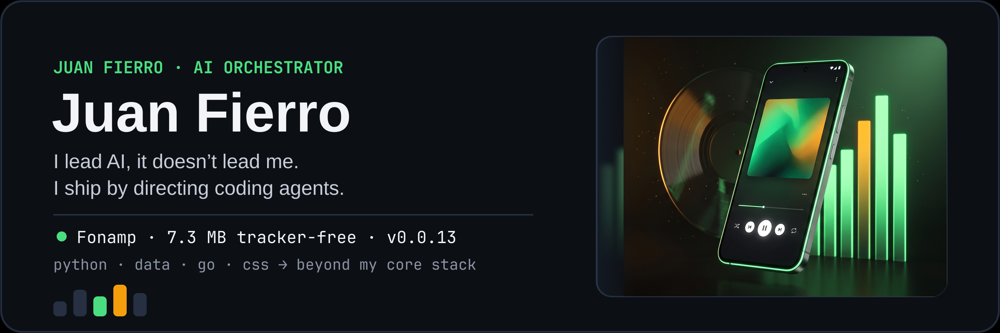
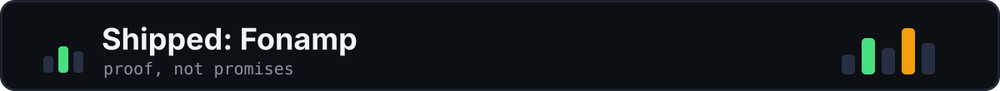
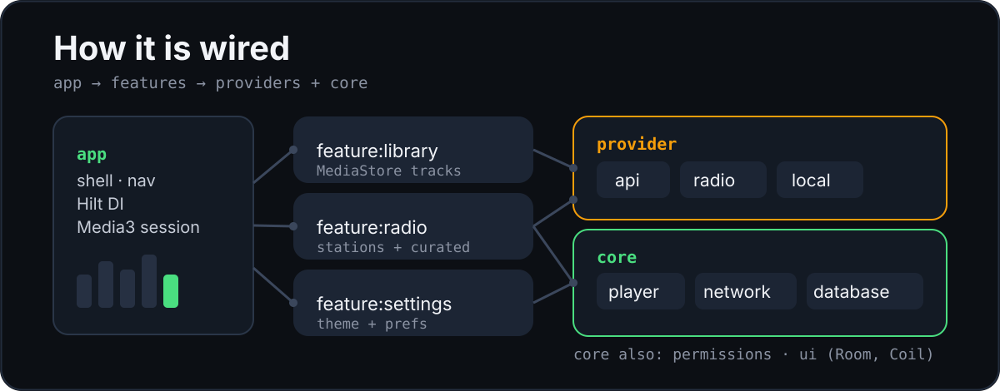
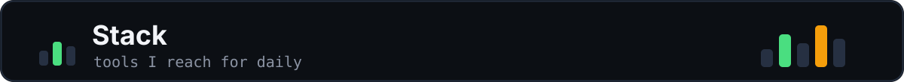
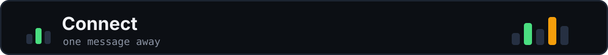
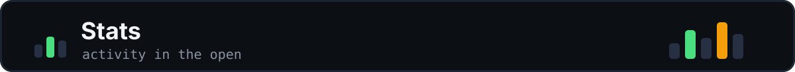

  

### Hi, I'm Juan Fierro

I'm a builder based in Colombia, focused on Python, data, and LLM training with NumPy and Pandas, plus Go and CSS.

I lead AI, it doesn't lead me — I ship by directing OpenCode, Pi agent, and GentleAI. My shipped proof is Fonamp, a 7.3 MB tracker-free Android player built outside my core stack.

- 🚀 Currently shipping: [Fonamp](https://github.com/Juanstudy/fonamp), a lightweight native Android music player
- 🌱 Currently learning: LLM training workflows (Python, NumPy, Pandas), plus Go and CSS
- 📥 Reach me: [juanstudy@gmail.com](mailto:juanstudy@gmail.com)

  

[Fonamp](https://github.com/Juanstudy/fonamp) — lightweight native Android player. See [releases](https://github.com/Juanstudy/fonamp/releases).

  

- On-device music library plus internet radio (RadioBrowser) in a single 7.3 MB app.
- Built with Media3, Hilt, and Room; v0.0.13, minSdk 29, target 35.
- Private by design: no ads, no analytics, no Firebase, no trackers.

  

  

**Languages**

**Data / AI**

**Web**

**Workflow**

  

  

  
📈 GitHub Stats

   
  

    
    
  

  <!-- Upstream paused 2026-09-24 (503 DEPLOYMENT_PAUSED on both cards). Self-host github-readme-stats to restore reliably. -->

